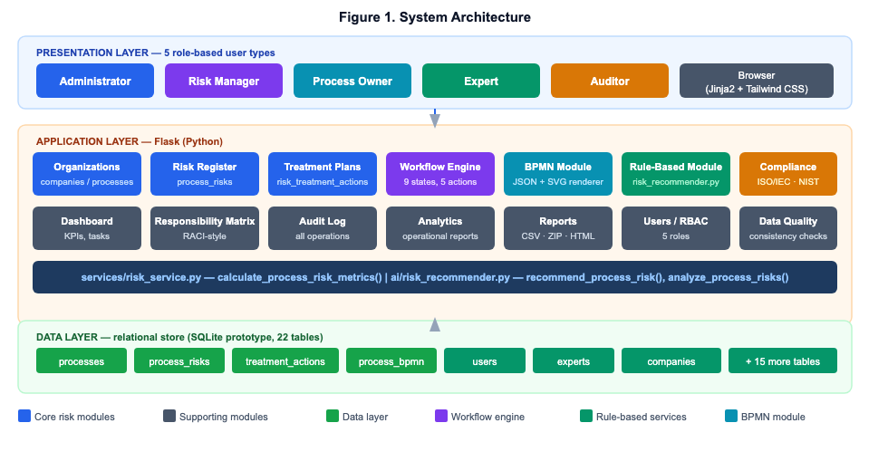
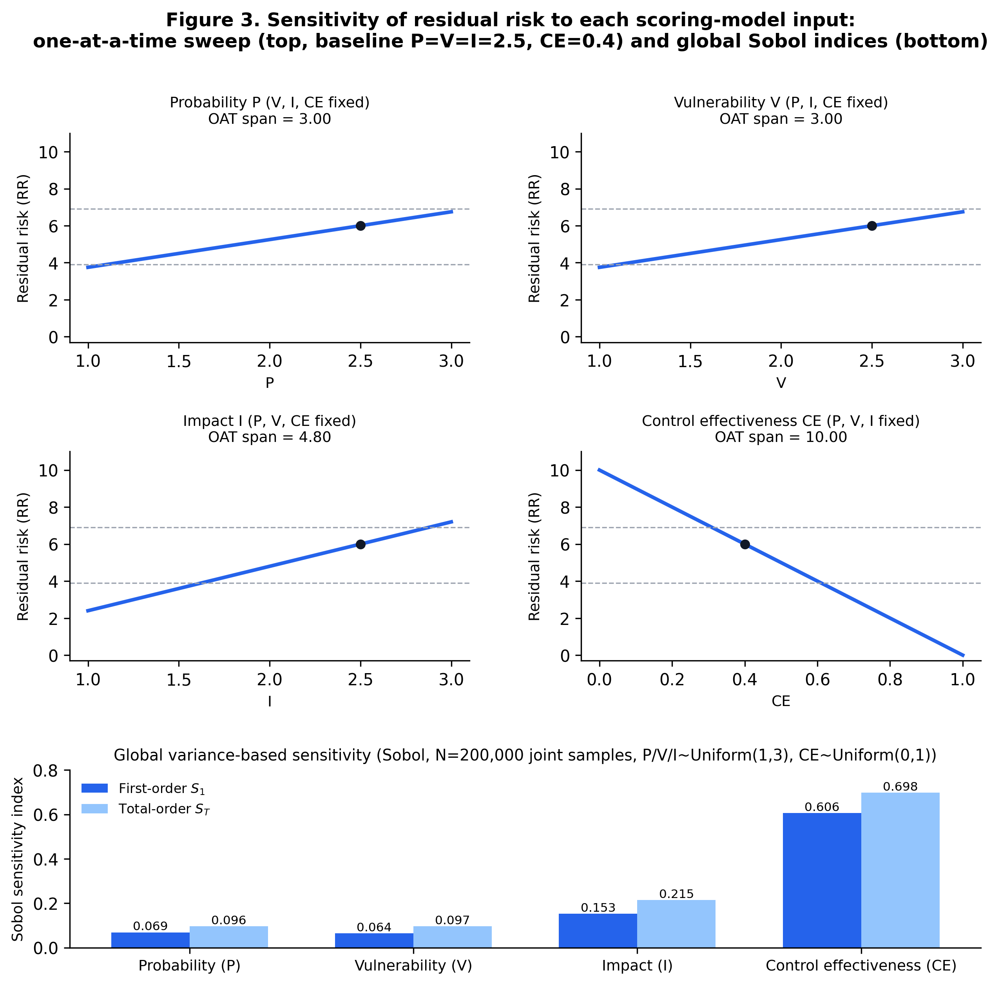
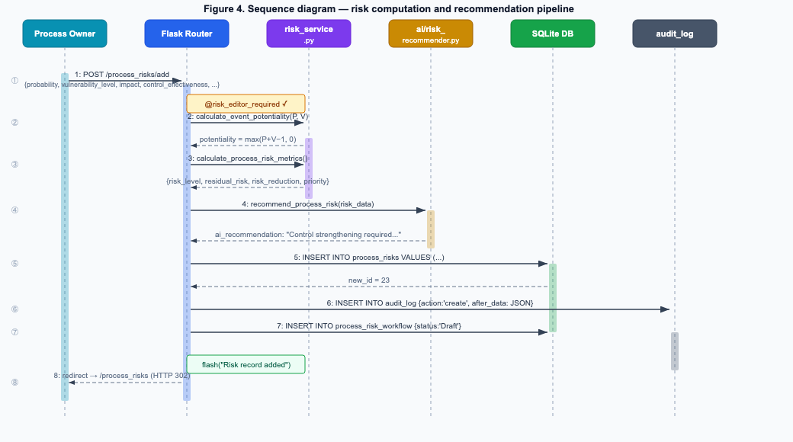
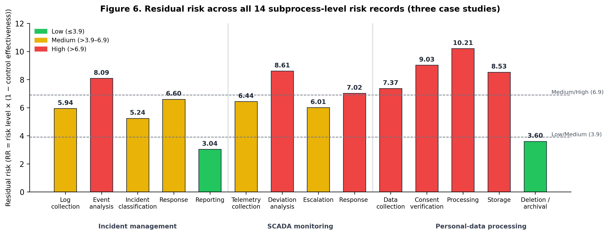

# Title (draft)

**Subprocess-Level Residual Risk Computation for BPMN Models: A Rule-Based Decision-Support Framework with Compliance Evidence Mapping**

*Short title for running head:* Process-Oriented Risk Assessment Framework with BPMN and Rule-Based Recommendations

**Authors:** Askhat Amrenov, Dina Satybaldina, Assel Nurusheva, Aliya Issainova

**Affiliation (all authors):** [Department/Institute name], L.N. Gumilyov Eurasian National University, Astana, Kazakhstan

***** Correspondence:** Dina Satybaldina, [institutional email]

---

## Abstract

Risk assessment in information security and critical-infrastructure operations typically treats assets and business processes separately, leaving BPMN diagrams without quantitative, auditable risk annotations. We present a rule-based decision-support framework that computes residual risk per BPMN subprocess (potentiality × impact × (1 − control effectiveness)), renders it on the diagram, and links it to compliance evidence (ISO/IEC 27001, IEC 62443, NIST CSF, NISTIR 8259). Three case studies demonstrate the formulas; a global Sobol analysis shows control effectiveness dominates output variance by construction. An 8-participant pilot compared the framework's residual-risk category, from each participant's own P/V/I/CE inputs, against that same participant's own holistic Low/Medium/High rating. Agreement was poor and one-directional (15.0% exact, weighted κ = 0.087; framework lower in 85% of disagreements). Substituting risk level (pre-control-discount) for residual risk, under the same fixed thresholds, raised agreement to 97.5% (κ = 0.960) — indicating a construct mismatch between elicited residual risk and spontaneous holistic judgment, though a task-order anchoring effect cannot yet be excluded. Usability of the framework's report was rated highly (SUS = 86.2/100) under demand-effect-prone conditions. We treat this diagnostic as the paper's principal empirical contribution and identify a counterbalanced, construct-disambiguated follow-up pilot as the priority for future work.

**Keywords:** risk assessment; decision support system; BPMN; business process risk management; multi-criteria decision analysis; information security; compliance management; critical infrastructure; expert systems; rule-based reasoning

---

## 1. Introduction

Risk assessment in information security and critical-infrastructure operations is traditionally organized around one of two views. The *asset-centric* view, exemplified by classical ISO/IEC 27005-style methodologies [1] and NIST SP 800-30 [2], scores individual assets on criticality and threat exposure and aggregates the result into an organizational risk register. The *process-centric* view, more common in operational-risk and business-continuity practice, treats risk as a property of workflows — a process fails or is delayed because a step, actor, or supporting asset is compromised — and increasingly uses BPMN as the shared visual language between security analysts and process owners [3].

In practice, these two views are rarely integrated in a single operational tool. Asset-risk registers do not show *where in a process* a vulnerable asset is used, and BPMN process models are rarely annotated with quantitative residual-risk values that a risk manager can rank and act on. This gap is especially visible in small and medium organizations and in academic/educational risk-management deployments, where dedicated GRC (governance, risk, and compliance) platforms are too costly and generic spreadsheet-based registers do not scale to multi-process, multi-expert assessment.

This paper presents a framework, implemented as a working web application, that closes this gap by:

1. keeping a multi-criteria asset-scoring layer (six weighted criteria, expert-averaged) as the entry point for asset criticality, consistent with established multi-criteria risk-scoring practice such as AHP-based criticality/incident-prioritization models [7], while making explicit that the specific criteria weights used here are current system defaults rather than values traceable to a specific published elicitation (Section 3.2, Section 6.3);
2. extending the asset layer with a process/subprocess hierarchy in which each subprocess is linked to the assets it uses, to a BPMN diagram, and to one or more explicit risk records (threat, vulnerability, control, and control effectiveness);
3. computing potentiality, risk level, and residual risk for every subprocess-level risk record using an explicit, auditable formula rather than a black-box score, and prioritizing mitigation using a rule-based scheme that jointly considers risk reduction, asset value, and mitigation cost;
4. attaching a lightweight rule-based recommendation module that surfaces actionable findings (missing controls, weak controls, recurring vulnerabilities) directly in the process report, avoiding the opacity and validation burden of machine-learning classifiers while still automating a first pass of risk triage;
5. linking risk and control records to compliance requirements from ISO/IEC 27001 [14], IEC 62443 [11], NIST Cybersecurity Framework (CSF) [12], and NISTIR 8259 [13], so that a single risk record can serve simultaneously as an audit-evidence artifact.

We deliberately avoid describing the recommendation module as "artificial intelligence" in the machine-learning sense: it is a transparent, rule-based expert system, and we treat this as a design choice rather than a limitation, since transparency and auditability are first-order requirements in regulated risk-management contexts, a concern that motivates a growing explainability literature even for learned models in security applications [9,22].

Distilled from the design points above, the contributions of this paper are:

1. a subprocess-level residual-risk computation that is stored and rendered directly on BPMN nodes, rather than layered on afterward as a separate visualization (Sections 3.3, 3.5), at a finer granularity than the BPMN risk extensions we are aware of [4–6,15] (Section 6.2 compares these directly);
2. a single schema connecting asset criticality, subprocess-level process risk, workflow state, and compliance evidence, so that one risk record can support both quantitative prioritization and audit-evidence reporting, with the latter illustrated by a coverage query on the illustrative demonstration database (Sections 3.6, 4.1) — a query most GRC tooling cannot answer at this granularity, though we have not measured coverage on a real deployment;
3. an auditable, rule-based recommendation layer whose every output is recomputable from stored inputs by design, positioned explicitly against — not as a subset of — machine-learning risk-scoring approaches, with the trade-off (no learning from historical outcomes) stated as a limitation rather than elided (Sections 2.3, 3.4, 6.3);
4. an explicit rationale for the scoring formulas, including a global, variance-based sensitivity analysis (Sobol indices, Section 3.3) that we present as a transparency exercise showing which design choices drive the model's output by construction, not as an empirical discovery;
5. a working prototype implementation, demonstrated across three illustrative domains (Section 4) and a completed 8-participant pilot study (Section 5) that identifies a construct mismatch between elicited residual-risk categories and experts' spontaneous holistic risk judgment — a diagnostic, reported in full, that we treat as the pilot's principal finding, since it points to a general instrument-design hazard for any residual-risk elicitation task, not only this framework's default thresholds.

The remainder of the paper is organized as follows. Section 2 reviews related work. Section 3 describes the system architecture and the formal risk model. Section 4 presents three illustrative case studies. Section 5 reports a completed pilot validation study. Section 6 discusses the framework in relation to established methodologies and to direct BPMN-risk competitors, and states its limitations. Section 7 concludes and outlines future work, with a construct-disambiguated, order-counterbalanced follow-up pilot as the top priority.

---

## 2. Related Work

**2.1 Asset-centric and standard risk methodologies.** ISO/IEC 27005 [1], NIST SP 800-30 [2], and ISO 31000 [21] define risk as a function of likelihood and impact, moderated by control effectiveness, and remain reference methodologies for information-security and general organizational risk registers. The Factor Analysis of Information Risk (FAIR) model [8] reframes this in probabilistic, loss-exceedance terms, offering more statistically rigorous aggregation at the cost of requiring loss-distribution data that many organizations lack. Multi-criteria decision analysis (MCDA) methods, including AHP-weighted incident-prioritization and risk-index scoring [7], are widely used to convert qualitative asset attributes (life/health, economic, ecological, social, dependency, and international/reputational impact in our case) into a single criticality score; our six-criterion weighting scheme follows this tradition, but the specific numeric weights currently in use are development-team defaults, not values we can trace to a specific published AHP elicitation for this criterion set — a limitation discussed in Section 6.3.

**2.2 Process-oriented and BPMN-based risk modeling.** A growing body of work integrates risk management with business process modeling under the "risk-aware business process management" (R-BPM) paradigm [3], and multiple BPMN extensions have been proposed to annotate diagrams with risk or security indicators, including SecBPMN for security-policy-driven process design [4], BPRIM as an integrated business-process/risk-management framework [5], riskaBPMN as a lightweight BPMN extension for quantitative risk annotation [6], and, more recently, Thabet et al.'s multi-view modeling method and tool for R-BPM, which addresses the usability cost of the meta-model complexity that risk-annotated process models tend to accumulate [20]. Rosado et al. [15] proposed MARISMA-BP, a pattern-based extension enabling security risk assessment and management directly for business process models, addressing the same organizational need — risk visibility at the process-design level — that motivates the present framework. More recently, Zareen and Anwar [25] evaluated a BPMN security extension against the Method Evaluation Model, illustrating that usability evaluation of BPMN risk/security extensions is itself an active, current concern rather than a solved problem, and Dedousis et al. [28] took a complementary, discovery-oriented approach, using process mining on event logs to automatically derive a risk-annotated process model rather than relying on an assessor's manual scoring — an alternative to the manually-scored, subprocess-level approach taken here that could in principle supply less subjective *P*/*V* inputs in organizations with rich enough event logs. This literature generally treats BPMN annotation as a visualization layer over a separately computed risk score; our contribution is to make the subprocess the unit of risk computation itself, so that residual risk, risk reduction, and mitigation priority are computed and stored per subprocess-asset-threat combination and then rendered onto the BPMN diagram, rather than the reverse. Section 6.2 compares the present framework against [4], [5], [6], and [15] directly, along the dimensions of granularity, computation form, residual-risk support, compliance linkage, and validation status.

**2.3 Rule-based versus learned decision support in security risk management.** Machine-learning-based risk scoring and threat/anomaly detection have received substantial attention [10], but rule-based expert systems remain common in regulated and audit-facing risk contexts precisely because their reasoning is traceable to an explicit rule and an inspectable input, which matters for compliance evidence and for organizations without labeled historical incident data to train a model — a traceability gap that the explainable-ML-for-security literature is itself trying to close for learned models [9,22]. Sarker et al. [16] make a related argument specifically for critical-infrastructure cybersecurity, proposing a taxonomy of rule-based AI methods precisely because their transparency and auditability properties are difficult to replicate in learned models, and arguing for automation that remains inspectable rather than automation at any cost. We position our recommendation module in the same rule-based tradition, and explicitly scope machine-learning extensions (e.g., learned criteria weights, incident-probability forecasting) as future work rather than claiming them prematurely.

**2.4 Compliance and evidence management.** Frameworks such as ISO/IEC 27001 [14], IEC 62443 (industrial automation and control systems security) [11], the NIST Cybersecurity Framework [12], and NISTIR 8259 (IoT device cybersecurity) [13] each define control catalogs but are rarely linked at the level of an individual process risk record; most GRC tooling maps controls to standards at the organizational or asset level. Our framework links compliance requirements directly to the same risk record used for quantitative scoring, so that one evidentiary artifact answers both "how risky is this" and "which requirement does this control satisfy"; Section 4.1 illustrates this with a concrete coverage query on the illustrative demonstration database rather than only describing the capability abstractly.

---

## 3. System Architecture and Methodology

### 3.1 Overview

The framework is implemented as a Flask (Python) web application backed by a relational (SQLite in the current prototype) schema of 22 tables, with role-based access control for five roles: administrator, expert, process owner, risk manager, and auditor. The architecture separates (a) an asset layer inherited from an earlier asset-centric version of the system, (b) a process layer (companies → processes → subprocesses → linked assets → BPMN diagram → process risks), (c) a risk-calculation service module, (d) a rule-based recommendation module, and (e) a compliance-evidence layer. Figure 1 shows the three-tier architecture (presentation, application, data); Figure 5 (Section 3.5) shows a representative BPMN diagram with subprocess nodes color-coded by the maximum residual risk of their associated risks (green/yellow/red for low/medium/high).

**Figure 1.** System architecture. The presentation layer serves five role-based user types through server-rendered templates; the application layer hosts the process/risk register, the workflow engine, the BPMN module, the rule-based recommendation service, and the compliance module; the data layer persists all entities in a 22-table relational schema (SQLite in the current prototype).

Figure 2 details the core part of this schema at the entity level.

**Figure 2.** Simplified entity-relationship model. `process_risks` (marked ★) is the central table: every subprocess-level risk record carries its own probability/vulnerability/impact/control-effectiveness inputs and computed risk fields, and is linked outward to workflow history (`process_risk_workflow`), multi-expert input (`risk_expert_assessments`), treatment plans (`risk_treatment_actions`), and — through those treatment plans — to compliance evidence (`compliance_evidence`). The legacy asset-centric tables (right) remain in place and continue to feed the multi-criteria asset-scoring layer described in Section 3.2.

### 3.2 Multi-criteria asset scoring

Each asset is scored by one or more experts on six criteria, each on a 0–10 scale: life and health (*w* = 0.419), economic (*w* = 0.252), ecological (*w* = 0.099), dependency (*w* = 0.144), social (*w* = 0.051), and international/reputational (*w* = 0.035). These specific weight values are current defaults set by the system's original developers, consistent with the general practice in asset-criticality schemes of weighting life/health highest, but we could not trace them to a specific published AHP or Delphi elicitation for this exact six-criterion set, and we say so explicitly rather than describe them as validated. Per-asset scores are averaged across experts, and criticality is computed as the weighted sum:

*criticality* = Σ (criterion score × weight)

Impact is derived from criticality on a 1–3 scale:

*impact* = 1 + (criticality / 10) × 2

This asset-level layer feeds both the legacy asset-risk register and, where an asset is linked to a subprocess, the process-level risk records described next.

### 3.3 Process-level risk model

For every subprocess-level risk record, three expert- or system-derived inputs are required: probability (*P*, 1–3 scale), vulnerability level (*V*, 1–3 scale), and impact (*I*, 1–3 scale, either inherited from the linked asset or entered directly), together with control effectiveness (*CE*, 0–1) and mitigation cost (*C*, ordinal 1–5) and asset value (1–10). The framework computes:

- **Potentiality**: *Pot* = max(*P* + *V* − 1, 0)
- **Risk level**: *RL* = *Pot* × *I*
- **Residual risk**: *RR* = *RL* × (1 − *CE*)
- **Risk reduction**: *ΔR* = *RL* − *RR*
- **Risk category**: Low if *RR* ≤ 3.9; Medium if 3.9 < *RR* ≤ 6.9; High if *RR* > 6.9

These three bands are contiguous and non-overlapping by construction, and the same two boundary values (3.9 and 6.9) are used everywhere in the system — including the rule-based recommender's "high priority" trigger (Section 3.4) — so that a risk record's category and its recommendation text can never disagree about whether it is "High." We are explicit that 3.9 and 6.9 are development-team defaults chosen to divide the numeric range the system's own case data happened to occupy, not values derived from a formal statistical procedure, a standards body, or an elicitation study, and we do not claim otherwise; fixed cut-points on an otherwise continuous risk score are known in the risk-analysis literature to introduce boundary artifacts of exactly this kind, independent of where the specific numbers are set [24]. Section 5.4 reports pilot evidence bearing on these boundary values, though the pilot's primary finding turned out to implicate the *construct* elicited by the comparison instrument at least as much as the specific thresholds themselves (Section 5.4.3); Section 6.3 and Section 7.1 discuss both possibilities and identify a construct-disambiguated follow-up study as the necessary next step before either is corrected.

*P*, *V*, and *I* are ordinal 1–3 scales and *CE* is scored in quarter-point increments from 0 to 1 when entered by a single assessor through the application's data-entry form; Table 1 gives the anchor definitions used to assign each level consistently, so that two assessors scoring the same subprocess are working from the same written criteria rather than an unanchored numeric impression. These are the same anchors used as the scoring instrument in the pilot validation study (Section 5). The case-study tables in Section 4, by contrast, report decimal values (e.g., *P* = 2.6). We are explicit that these are not the output of any actual multi-scorer elicitation process: they are single-point illustrative parameter values chosen directly by the development team at one-decimal resolution, to space the three case studies across a range of control-maturity levels (Section 4), and they should not be read as an average of real or hypothetical raw anchored responses. We flag this distinction explicitly in each case-study table caption so that Table 1's integer anchors are not mistaken for the resolution at which Tables 2, 4, and 5 were constructed.

**Table 1.** Anchor definitions for the four scoring-model inputs.

| Scale | Level | Anchor definition |
|---|---|---|
| Probability (*P*) | 1 (Low) | Threat event unlikely within the review period; no comparable occurrence in the past 12 months and no persistent enabling condition. |
| Probability (*P*) | 2 (Medium) | Threat event plausible; occurred elsewhere in the organization/sector within the past 12 months, or enabling conditions are present intermittently. |
| Probability (*P*) | 3 (High) | Threat event likely or recurring; has occurred in this process before, or enabling conditions are persistently present. |
| Vulnerability (*V*) | 1 (Low) | No known exploitable weakness on the path to the threat event; existing safeguards already address it. |
| Vulnerability (*V*) | 2 (Medium) | A partial or inconsistently applied weakness exists on the path to the threat event. |
| Vulnerability (*V*) | 3 (High) | A known, currently unaddressed weakness exists directly on the path to the threat event. |
| Impact (*I*) | 1 (Low) | Limited, recoverable consequence; resolved within routine operations. |
| Impact (*I*) | 2 (Medium) | Moderate consequence requiring management attention (e.g., a contained service disruption or data exposure). |
| Impact (*I*) | 3 (High) | Severe consequence (e.g., safety impact, large-scale exposure, extended outage of a critical system, or regulatory exposure). |
| Control effectiveness (*CE*) | 0.00 | No control in place. |
| Control effectiveness (*CE*) | 0.25 | Control exists but is manual, inconsistently applied, or unverified. |
| Control effectiveness (*CE*) | 0.50 | Control is implemented and applied, but not independently tested or audited. |
| Control effectiveness (*CE*) | 0.75 | Control is implemented, tested, and audited, with minor residual gaps. |
| Control effectiveness (*CE*) | 1.00 | Control is implemented, tested, audited, and has demonstrated effectiveness (e.g., through incident history or drills). |

We note explicitly that *CE* = 1.00 drives *RR* to exactly zero, which is a modeling idealization rather than a claim that any control reduces real-world residual risk to a literal zero; the anchor description ("demonstrated effectiveness") is intended as an asymptotic ceiling for a well-evidenced control, and organizations adopting the framework should treat a computed *RR* = 0 as "effectively controlled to the limit of this model," not as a guarantee of zero incident probability. We did not impose a numeric ceiling below 1.00 in the current implementation because doing so would be an arbitrary correction without empirical grounding of its own; we flag the interpretive risk here instead.

Mitigation **priority** is computed by a three-factor ordinal scoring rule rather than a single continuous formula, to keep the recommendation auditable:

- value score = 3 if asset value ≥ 7, else 2 if ≥ 4, else 1
- reduction score = 3 if *ΔR* ≥ 5, else 2 if ≥ 2, else 1
- cost score = 3 if cost ≤ 2, else 2 if ≤ 5, else 1
- priority = HIGH if the sum ≥ 8, MEDIUM if ≥ 5, else LOW

This rule explicitly rewards mitigations that are cheap, address high-value assets, and yield large risk reduction, and it is fully traceable: an auditor can recompute the three sub-scores from the stored inputs without re-running any opaque model. Because priority depends on cost and asset value in addition to residual risk, it can rank a Low-*category* risk above a High-*category* one when the former is a cheap fix to a valuable asset; Section 4.1 and Section 4.4 report two such cases from the case studies explicitly, rather than only the reverse (a High-risk item downgraded by cost), so that this behavior is documented in both directions.

#### Rationale for the scoring model

The formulas above are an engineering heuristic, not a formally derived probabilistic model, and we state the reasoning behind each design choice explicitly, including where a choice is a pragmatic trade-off rather than a principled derivation, so that it can be evaluated (and challenged) on its own terms.

*Why potentiality is additive (P + V), not multiplicative (P × V).* Both *P* and *V* are ordinal 1–3 scales (1 = low, 2 = medium, 3 = high). A multiplicative combination compresses the lower half of the joint range while stretching the upper half (3 × 3 = 9 versus 1 × 1 = 1, a ninefold spread against a threefold spread in each input), which we judged undesirable given that the classification bands (Section 3.3) are linear thresholds on the resulting risk-level scale. The additive form keeps the combination linear in each input, avoiding the need to re-derive those bands for a multiplicative scale.

*Why the "− 1" shift, and an honest accounting of what this choice costs.* Without the shift, *P* + *V* has a floor of 2 (both inputs at their minimum), which we judged should map closer to "no potentiality" than to a mid-scale value; subtracting 1 moves that floor case to *Pot* = 1. We initially motivated this by appeal to the ISO/IEC 27005 principle that risk requires both a credible threat and an exploitable vulnerability to be simultaneously present [1] — but on reflection, a conjunctive (both-required) requirement is more naturally expressed multiplicatively (a single near-zero factor should suppress the whole product), and the additive form we chose does not do this: it is compensatory, so a high *V* can offset a low *P* (e.g., *P* = 1, *V* = 3 gives the same *Pot* = 3 as *P* = 3, *V* = 1). We therefore no longer present the "− 1" shift as a derivation from the ISO/IEC 27005 conjunction principle; it is a linear re-centering chosen for the reason given in the previous paragraph (keeping the classification bands linear and interpretable), and the compensatory behavior it inherits from the additive form is a known, accepted trade-off, not a property we can claim is standards-derived.

*Why max(·, 0) rather than allowing negative values.* Under the documented 1–3 input domain, *P* + *V* − 1 has a minimum of 1, so the floor at zero is never actually triggered by in-range inputs; we keep it as a defensive guard against out-of-range data, and we say so explicitly here rather than let a reader assume it does load-bearing work in the case studies of Section 4.

*Why the inputs are not normalized to [0, 1] for data entry.* A linear rescaling would not change the ordering of any classification, but it would require assessors to enter fractional scores instead of the Likert-style anchors (1 = low, 2 = medium, 3 = high) that domain experts are already trained to use in adjacent methodologies (e.g., NIST SP 800-30's qualitative/semi-quantitative scales [2]); we treat this as a usability decision for data entry, separate from the analytical normalization used in the sensitivity analysis below.

*Why potentiality is multiplied by impact (Pot × I), even though P and V were combined additively.* Potentiality and impact represent conceptually different axes — a likelihood-side combination versus a consequence-side severity — and the standard risk formulation in ISO/IEC 27005 and NIST SP 800-30 is risk = likelihood × impact [1,2]; we preserve that multiplicative structure for the final combination step while reserving the additive treatment specifically for merging the two likelihood-side factors before that final multiplication.

*Sensitivity of the output to each input.* Figure 3 reports a one-at-a-time (OAT) sensitivity analysis: starting from a baseline of *P* = *V* = *I* = 2.5, *CE* = 0.4, each input is swept across its own full domain while the other three are held fixed. Sweeping *P* or *V* alone moves *RR* by 3.00; sweeping *I* moves it by 4.80; sweeping *CE* moves it by 10.00. We are explicit that this OAT comparison is a mechanical consequence of each variable's role in the formula and its own domain width, not an emergent or surprising property, and that raw OAT "spans" are not a rigorous way to compare inputs defined on different domains and playing different roles (an additive term vs. a multiplicative discount) in the same formula — a well-known limitation of one-at-a-time sensitivity analysis in general [23]. To address this rigorously, we additionally computed global, variance-based Sobol sensitivity indices by Monte Carlo estimation (Saltelli-style, *N* = 200,000 joint samples of *P*, *V*, *I* ~ Uniform(1,3) and *CE* ~ Uniform(0,1), independent of each other, evaluated against the same formula), which decompose the *variance* of *RR* over the full joint input space rather than the range along one axis at a time, and which account for interaction effects that OAT ignores entirely. The result: first-order index *S₁* = 0.606 for *CE* (i.e., *CE* alone explains 60.6% of the variance of *RR* over the joint input space), versus *S₁* = 0.153 for *I*, 0.069 for *P*, and 0.064 for *V*; total-order indices (own effect plus all interactions) are *S_T* = 0.698 for *CE*, 0.215 for *I*, 0.096 for *P*, and 0.097 for *V*. The variance-based analysis therefore supports the same qualitative conclusion as the OAT analysis — *CE* dominates the model's output — but by a method that is robust to the domain-comparability objection that applies to raw OAT spans. We present both because the OAT figure is easier to read for a specific baseline point, while the Sobol indices are the methodologically defensible basis for a general dominance claim; we do not present this as an empirical discovery about real-world risk (Section 4.4 revisits this distinction).

**Figure 3.** One-at-a-time sensitivity of residual risk to each scoring-model input at a fixed baseline. Control effectiveness has the largest OAT span (10.00). A global, variance-based Sobol analysis over the full joint input space (reported in the text) corroborates this with first-order index *S₁* = 0.606 for *CE* versus ≤ 0.153 for the other three inputs, which is the more rigorous basis for the dominance claim than the OAT span comparison alone.

Figure 4 traces this computation end to end as it occurs when a process owner submits a new risk record: the Flask route calls `calculate_event_potentiality`, then `calculate_process_risk_metrics`, then the rule-based recommender, then persists the risk record, an audit-log entry, and an initial workflow entry, in that order, all within a single request/response cycle.

**Figure 4.** Sequence diagram of the risk-computation-and-recommendation pipeline triggered by a `POST /process_risks/add` request. Steps 2–3 compute potentiality and the full risk-metric set (Section 3.3); step 4 invokes the rule-based recommender (Section 3.4); steps 5–7 persist the risk record, the audit-log entry, and the initial workflow state, respectively.

### 3.4 Rule-based recommendation module

For every process risk record, the framework generates a natural-language recommendation from a small, explicit rule set (implemented as ordered conditional checks rather than a trained classifier): residual risk above 6.9 (the same boundary used for the High category) triggers a "high priority mitigation" flag; the absence of an assigned control triggers a control-assignment recommendation; vulnerability level ≥ 3 triggers an urgent-remediation flag; control effectiveness below 0.3 combined with residual risk above 6.9 triggers a control-strengthening recommendation; and the risk category (Low/Medium/High) determines a closing statement about acceptability, monitoring, or priority remediation.

At the process level, an aggregate score is computed from the maximum residual risk across the process's risk records (weight 0.65), the average residual risk across the process (weight 0.25), and the count of High-category subprocesses capped at three (weight 0.3 each), and the raw sum is then capped at a ceiling of 9:

*score* = min( max_RR × 0.65 + avg_RR × 0.25 + min(high_count, 3) × 0.3 , 9 )

The ceiling is a deliberate scale-bounding step in the implementation (`ai/risk_recommender.py`). Without it, the theoretical maximum of the unclipped sum is 14.4 (at max_RR = avg_RR = 15, the ceiling value of *RR* itself, and high_count ≥ 3), not 9. We show the ceiling explicitly here because Section 4.3 reports a case in which the unclipped sum (9.47) exceeds the displayed, clipped value (9.0), and the clip must be visible in the formula for that value to be reproducible from the text alone. The resulting score maps to a process rating: Critical if score ≥ 7, High if ≥ 5, Medium if ≥ 3, else Low. The module additionally surfaces the single highest-residual-risk subprocess, all risks lacking an assigned control, all risks with control effectiveness below 0.3, and threats or vulnerabilities that recur across two or more subprocesses.

### 3.5 BPMN integration

Each process has an associated BPMN diagram stored as JSON (nodes typed as start/task/gateway/end, edges with optional labels for gateway branches) and rendered as an SVG diagram with automatic layered layout. Nodes may be bound to a subprocess identifier; the renderer then colors each node by the maximum residual risk among that subprocess's risk records (green ≤3.9, yellow >3.9–6.9, red >6.9), giving process owners a risk-annotated process view without requiring them to read the underlying risk register. Figure 5 is an English-labeled redraw of this rendering for the information-security incident-management process used as Case Study 1 (Section 4.1), constructed the same way as Figures 1, 2, and 4 (Appendix, project repository) from the application's own BPMN viewer output rather than presented as a live screenshot, since the running application's interface is currently Russian-language only: the residual-risk value computed for each of the five named subprocesses (Table 2) is shown under the corresponding node, and the gateway branch for critical incidents routes to containment and deep analysis while the non-critical branch routes to standard response, both converging before the closing report step.

**Figure 5.** Risk-annotated BPMN diagram for Case Study 1 (information-security incident management), English-labeled redraw of the application's BPMN viewer output (the live interface is Russian-language only). Node color and the numeric label below each bound node reflect the residual risk of the subprocess computed in Table 2 (e.g., 5.94/Medium for log collection, 8.09/High for event analysis).

### 3.6 Compliance evidence layer

Risk and control records can be mapped to requirements drawn from ISO/IEC 27001, IEC 62443, the NIST Cybersecurity Framework, and NISTIR 8259. Each risk record therefore doubles as a compliance-evidence artifact: the same probability/vulnerability/control-effectiveness inputs and the resulting residual-risk value that support the quantitative priority ranking are also attached to the specific control requirement they help satisfy, and each risk carries a workflow state (Draft → In review → Owner approved → Approved → Mitigation planned → In progress → Mitigated → Accepted → Closed, with a Returned state for rework) so that both risk-treatment progress and audit status are tracked in one place. Section 4.1 reports the actual compliance-evidence coverage achieved on Case Study 1's demonstration data (2 of 5 risk records mapped, 40%) as a concrete, if modest, illustration of this layer rather than an abstract description of its intended capability; we treat evidence coverage itself as a metric this layer makes newly visible, distinct from whether coverage happens to be complete in a given demonstration database.

---

## 4. Case Studies

To illustrate the framework's behavior, we constructed three representative process scenarios: (1) information-security incident management, (2) SCADA infrastructure monitoring, and (3) personal-data processing. All three are **illustrative demonstration scenarios** populated with parameter values chosen by the development team to be representative of the corresponding domain, not measurements from a production deployment. We report them as a functional demonstration of the model's ability to differentiate risk and priority across heterogeneous process stages and control-maturity levels, not as an empirical validation against ground-truth incident data or against an alternative risk-scoring method (no such comparison was performed; Section 6.3 lists this as an explicit limitation).

**A note on how to read the Low/Medium/High labels below, stated here rather than only at the end of the paper.** Section 5 reports pilot evidence that the framework's residual-risk category (the *RR*-based Low/Medium/High label used throughout this section, Figure 5, and Figure 6) is a materially different construct from the holistic risk impression a domain expert forms spontaneously — the latter tracked *risk level before the control-effectiveness discount* far more closely than it tracked *RR* itself in our pilot (Section 5.4.3). The category labels below are therefore best read as what they are precisely defined to be — residual risk after the stated control effectiveness, relative to the fixed 3.9/6.9 boundaries defined in Section 3.3 — and not as an intuitive severity rating a reader should expect to match their own gut sense of "how bad is this." Where a conclusion below does not depend on which of the two constructs is used, we say so; where it specifically depends on the *RR*-based category, we flag that too.

### 4.1 Case study 1: Information-security incident management

The process comprises five subprocesses — log collection, event analysis, incident classification, response, and reporting — modeled as a BPMN diagram with a criticality gateway routing critical incidents through containment and deep analysis and non-critical incidents through standard response, with both paths converging on a post-incident review and report step. Table 2 summarizes the risk computed at each subprocess; as noted in Section 3.3, the *P*/*V*/*I*/*CE* values below are single-point illustrative parameter values chosen directly by the development team at one-decimal resolution, not an average of any real or hypothetical multi-scorer process, and not a single assessor's raw 1–3/quarter-point anchored response.

**Table 2.** Risk-oriented BPMN case study — information-security incident management.

| Subprocess | P | V | I | CE | Cost | Asset value | Potentiality | Risk level | Residual risk | Risk reduction | Category | Priority |
|---|---|---|---|---|---|---|---|---|---|---|---|---|
| Log collection | 2.6 | 2.4 | 2.7 | 0.45 | 3 | 8 | 4.00 | 10.80 | 5.94 | 4.86 | Medium | Medium |
| Event analysis (SIEM correlation) | 2.7 | 2.8 | 2.9 | 0.38 | 4 | 9 | 4.50 | 13.05 | 8.09 | 4.96 | High | Medium |
| Incident classification | 2.4 | 2.5 | 2.8 | 0.52 | 2 | 8 | 3.90 | 10.92 | 5.24 | 5.68 | Medium | High |
| Response (containment) | 2.8 | 2.6 | 3.0 | 0.50 | 3 | 9 | 4.40 | 13.20 | 6.60 | 6.60 | Medium | High |
| Reporting (post-incident review) | 2.1 | 2.2 | 2.3 | 0.60 | 2 | 7 | 3.30 | 7.59 | 3.04 | 4.55 | Low | High |

The case study illustrates a pattern that a purely asset-centric register would not surface: the highest residual risk (8.09, "High") occurs not at the most expensive or most valuable subprocess, but at *event analysis*, where control effectiveness is lowest (0.38) relative to a comparatively high combined probability-vulnerability score. This is the subprocess for which the rule-based module's residual-risk-above-6.9 rule fires, generating a high-priority-mitigation flag. The process-level aggregate score (Section 3.4) is computed from the maximum residual risk (8.09), the average residual risk across all five subprocesses (5.78), and the count of High-category subprocesses (one): 8.09 × 0.65 + 5.78 × 0.25 + 1 × 0.3 = 7.0035, which places the whole process in the "Critical" attention band (score ≥ 7) — two bands above the "Medium" band (score ≥ 3) and one above "High" (score ≥ 5). We flag this precisely because the unrounded value is 7.0035: the band assignment here is decided by the fourth decimal place of an input built from ordinal expert scores, which is a considerably sharper dependency on band boundaries than the rounded 7.00 alone would suggest, and a concrete illustration of the same threshold-sensitivity problem central to Section 5. This directs the process owner's attention to the event-analysis stage first, despite it not being the subprocess with the largest single risk-reduction opportunity (that being the response stage, at 6.60). Also notable: *reporting* carries the lowest residual risk of the five subprocesses (3.04, Low) but still receives High priority, because its low mitigation cost (2) and comparatively high asset value (7) push its priority sub-score to the HIGH band (3 + 2 + 3 = 8) even though the reduction on offer is modest — the same low-risk/cheap-fix pattern discussed further, with a second example, in Section 4.4.

To illustrate the compliance-evidence layer described in Section 3.6, Table 3 shows the actual compliance mapping recorded in the application database for this case study's five risk records: each treatment action can be linked to zero, one, or more compliance requirements, and the current implementation status of that evidence is tracked independently of the risk's own workflow status.

**Table 3.** Compliance-evidence mapping for Case Study 1, as recorded in the running application.

| Risk record | Treatment action | Standard | Requirement | Evidence status | Workflow status |
|---|---|---|---|---|---|
| Log collection (5.94, Medium) | Centralize log collection and verify source completeness | ISO/IEC 27001 | A.8.15 Logging | Implemented | Mitigation planned |
| Log collection (5.94, Medium) | Centralize log collection and verify source completeness | NIST CSF | DE.CM-01 Continuous monitoring | Implemented | Mitigation planned |
| Event analysis (8.09, High) | Update SIEM correlation rules and test detection use cases | NIST CSF | DE.CM-01 Continuous monitoring | Partially implemented | In progress |
| Incident classification (5.24, Medium) | Adopt incident-classification matrix and escalation SLA | — | *Not yet mapped* | — | Approved |
| Response (6.60, Medium) | Publish incident-response runbook with assigned roles | — | *Not yet mapped* | — | Mitigation planned |
| Reporting (3.04, Low) | Introduce post-incident review template and corrective-action log | — | *Not yet mapped* | — | Mitigated |

Compliance-evidence coverage on this demonstration database is therefore 2 of 5 risk records (40%), and the highest-residual-risk record (event analysis, 8.09) has only partial evidence for a single requirement. We report this coverage figure as-is: it is the honest current state of the demonstration database, not a claim that the layer is fully populated. What the layer adds, independent of how complete a given deployment's mapping happens to be, is the ability to query "which of our highest-priority risks currently lack mapped compliance evidence" at the individual-risk-record level rather than only at the organization or asset level — a query most GRC tooling cannot answer at this granularity (Section 2.4). Populating the remaining three mappings is a data-entry task for the process owner in this demonstration database, not a claim we make about the framework's general evidence-coverage rate, which we have not measured across a real deployment.

### 4.2 Case study 2: SCADA infrastructure monitoring

The process comprises four subprocesses — telemetry collection, deviation analysis, escalation, and response — reflecting a supervisory control and data acquisition (SCADA) monitoring workflow for critical infrastructure. Table 4 summarizes the risk computed at each subprocess, following the same per-subprocess structure as Case Study 1.

**Table 4.** Risk-oriented BPMN case study — SCADA infrastructure monitoring.

| Subprocess | P | V | I | CE | Cost | Asset value | Potentiality | Risk level | Residual risk | Risk reduction | Category | Priority |
|---|---|---|---|---|---|---|---|---|---|---|---|---|
| Telemetry collection | 2.4 | 2.3 | 2.9 | 0.40 | 4 | 9 | 3.70 | 10.73 | 6.44 | 4.29 | Medium | Medium |
| Deviation analysis | 2.6 | 2.5 | 3.0 | 0.30 | 3 | 9 | 4.10 | 12.30 | 8.61 | 3.69 | High | Medium |
| Escalation | 2.3 | 2.6 | 2.8 | 0.45 | 2 | 8 | 3.90 | 10.92 | 6.01 | 4.91 | Medium | High |
| Response | 2.2 | 2.4 | 3.0 | 0.35 | 5 | 9 | 3.60 | 10.80 | 7.02 | 3.78 | High | Medium |

Unlike Case Study 1, where control effectiveness was lowest at the subprocess with the highest combined probability-vulnerability score, here the highest residual risk (8.61, "High") occurs at *deviation analysis*, driven by outdated detection thresholds (*CE* = 0.30) rather than by the highest probability or vulnerability level in the table. The process-level aggregate score is 8.61 × 0.65 + 7.02 × 0.25 + 2 × 0.3 = 7.95, again in the "Critical" band, with two of four subprocesses (deviation analysis and response) already in the High category. Notably, *response* (residual risk 7.02, High) receives a Medium rather than High priority because its mitigation cost is highest (5) among the four subprocesses; the priority rule discounts costly fixes even when the underlying risk category is High, which is the deliberate design discussed in Section 3.3 — a naive "residual risk alone" ranking would rank the response stage above the cheaper, equally urgent escalation fix.

### 4.3 Case study 3: Personal-data processing

The process comprises five subprocesses — data collection, consent verification, processing, storage, and deletion/archival. Table 5 summarizes the risk computed at each subprocess.

**Table 5.** Risk-oriented BPMN case study — personal-data processing.

| Subprocess | P | V | I | CE | Cost | Asset value | Potentiality | Risk level | Residual risk | Risk reduction | Category | Priority |
|---|---|---|---|---|---|---|---|---|---|---|---|---|
| Data collection | 2.3 | 2.6 | 2.7 | 0.30 | 3 | 7 | 3.90 | 10.53 | 7.37 | 3.16 | High | Medium |
| Consent verification | 2.6 | 2.7 | 2.8 | 0.25 | 3 | 8 | 4.30 | 12.04 | 9.03 | 3.01 | High | Medium |
| Processing | 2.5 | 2.9 | 2.9 | 0.20 | 4 | 8 | 4.40 | 12.76 | 10.21 | 2.55 | High | Medium |
| Storage | 2.4 | 2.8 | 2.9 | 0.30 | 4 | 8 | 4.20 | 12.18 | 8.53 | 3.65 | High | Medium |
| Deletion / archival | 2.0 | 2.2 | 2.5 | 0.55 | 2 | 6 | 3.20 | 8.00 | 3.60 | 4.40 | Low | Medium |

This case study shows the model's sensitivity to control effectiveness most clearly: four of five subprocesses fall in the High category, and the lowest-control-effectiveness subprocess (*processing*, *CE* = 0.20) produces the single highest residual risk of all three case studies (10.21). The process-level aggregate score, before the ceiling described in Section 3.4, is 10.21 × 0.65 + 7.75 × 0.25 + 3 × 0.3 = 9.47 (average residual risk 7.75 across the five subprocesses; High-category count of 4, capped at 3 for this term); applying the ceiling gives a displayed score of min(9.47, 9) = 9.0, the maximum attainable value on the framework's clipped scale, ranking this as the highest-scoring of the three demonstration processes on the framework's own aggregate measure — a ranking claim, not a claim that 9.0 is the objectively correct severity for this process, which we have no independent ground truth to assess. We report both the pre-ceiling (9.47) and displayed (9.0) values here so that the number in the case study is reproducible from the formula in Section 3.4. The one subprocess in the Low category, *deletion/archival*, has both the lowest cost (2) and the highest control effectiveness (0.55) of the five.

### 4.4 Cross-case observations

Across the 14 subprocess-level risk records in the three case studies, residual risk ranged from 3.04 (Low, incident-management reporting) to 10.21 (High, personal-data processing) — a 3.36-fold difference (10.21 / 3.04 ≈ 3.36). Probability and impact inputs varied only modestly across the 14 records (2.0–2.8 and 2.3–3.0, respectively) while control effectiveness varied more widely (0.20–0.60). We are explicit that this pattern is partly **by construction**: the development team chose the illustrative *CE* values per subprocess specifically to exercise a range of control-maturity levels, and a comparatively narrow *P*/*V*/*I* range across three deliberately-authored scenarios does not, on its own, demonstrate that control effectiveness is the dominant real-world differentiator of process risk — that would require production incident data we do not have (Section 6.3). What the case studies *do* show, without circularity, is that the model's formulas translate a wide *CE* range into a wide *RR* range in a way that is consistent with, and traceable to, the global sensitivity analysis reported analytically in Section 3.3 (Sobol *S₁* = 0.606 for *CE*), which is a property of the formulas themselves and does not depend on how the case-study parameters happen to have been chosen.

The rule-based priority scheme repeatedly diverges from a pure residual-risk ranking once implementation cost enters the calculation. In Case Study 1, the *reporting* subprocess (Section 4.1) is Low-category but High-priority because it is a cheap fix (cost 2) to a moderately valuable asset (value 7); in Case Study 2, the *response* subprocess carries a High residual-risk category (7.02) but only Medium priority because its mitigation cost (5) is the highest in the table; in Case Study 3, all four High-category subprocesses receive Medium — never High — priority, because each subprocess's risk reduction (2.55–3.65) falls short of the 5.0 threshold needed for the top reduction-score tier, even though control effectiveness is low across the board. This is a direct consequence of the priority rule's design (Section 3.3): risk category reflects residual risk alone, while priority additionally weighs how much risk a mitigation would remove, its cost, and the asset's value — three quantities that do not necessarily move together.

**Figure 6.** Residual risk across all subprocess-level risk records in the three illustrative case studies. Bars are colored by risk category (green = Low, yellow = Medium, red = High); dashed lines mark the 3.9 and 6.9 classification boundaries used throughout the framework (Section 3.3). Section 5.4 reports pilot evidence that these boundary values, applied to *residual* risk, disagree with expert holistic judgment far more than the same boundary values applied to *risk level* (pre-control-discount) do — a finding primarily about which quantity the boundaries should be applied to, not about the illustrative values plotted here or about the boundary values themselves being wrong in isolation (Section 5.4.3).

---

## 5. Pilot Validation Study

Sections 3 and 4 describe the framework's formulas and demonstrate their behavior on illustrative data; neither is evidence that the framework's output agrees with independent domain-expert judgment. This section reports a completed pilot study designed to produce that evidence directly: agreement between independent experts, agreement between the framework's output and experts' own holistic judgment, and a structured usability assessment. All results below are from real data collected from real participants.

### 5.1 Design

A vignette-based protocol using a standardized employee-offboarding process ("Employee Offboarding / Access Revocation") that is not one of the three illustrative case studies in Section 4; the full vignette text is reproduced in Appendix A. Participants rated the same written process vignette rather than auditing their own organization's live process, so that every participant received identical context while still using a process familiar to IT, information-security, HR, and compliance professionals; the trade-off is that the pilot tests agreement and perceived usefulness under controlled case-description conditions, not the framework's performance during an in-situ organizational assessment. Each participant completed three tasks in a fixed order, independently and without seeing other participants' responses or the framework's own computed output until after Task 2:

- *Task 1 — Framework scoring.* For each of the five subprocesses in the vignette (offboarding request submission, access inventory and revocation, asset return and verification, knowledge transfer and handover, and compliance archival), the participant assigned *P*, *V*, *I* (1–3) and *CE* (0–1, quarter-point increments) using the anchor definitions in Table 1, exactly as an operator would when entering a risk record into the application.
- *Task 2 — Holistic assessment.* For the same subprocesses, the participant independently assigned a single overall risk rating (Low/Medium/High). The instruction given to participants, translated verbatim from the Russian-language instrument, was: *"For Task 2, forget about P/V/I/CE — give an overall assessment by intuition: Low / Medium / High"* (original: *"Для Task 2 — забудьте про P/V/I/CE, дайте общую оценку по интуиции: Low / Medium / High"*, `EXPERT_INSTRUCTIONS_RU.md`, project repository). We reproduce this wording exactly because it is analytically important: the instruction never specifies whether the participant should judge risk *before* mitigating controls (inherent risk) or *after* them (residual risk), despite Task 1 having just asked the same participant to explicitly score control effectiveness for the same subprocess. Section 5.4.3 shows this ambiguity is not a minor wording issue but the primary explanation for the pilot's central result.
- *Task 3 — Usability.* The participant was then shown the framework's actual computed output for the process (residual risk, category, priority, and rule-based recommendation text for each subprocess) and completed the 10-item System Usability Scale (SUS) [17] plus four open-ended questions on clarity, trust in the recommendation text, and perceived usefulness relative to their own Task 2 judgment.

### 5.2 Participants

*n* = 8 domain-relevant participants were recruited: an IT infrastructure manager (12 years' experience), a senior system administrator (15 years), an information-security analyst (10 years), a SOC manager/cybersecurity lead (14 years), an HR business partner (9 years), an HR operations manager (11 years), a compliance officer (8 years), and a GRC/compliance manager (15 years) — spanning the IT, information-security, HR, and compliance perspectives the vignette was designed to draw on. Participants were recruited by convenience sampling through the authors' professional network, not through open advertisement or random sampling from a defined population; we state this plainly as a source of selection bias in Section 6.3, since a convenience sample recruited by the instrument's developers is also a plausible contributor to the demand-characteristic effects discussed in Sections 5.4.5 and 5.4.6. No names are recorded; participants are identified only by role, years of experience, and an anonymous ID (P1–P8). We treat *n* = 8 as a pilot sample: it is sufficient to detect the large, consistent effects reported in Section 5.4, but several of the statistics below (notably Fleiss' κ over only 5 subprocess-units) have correspondingly wide confidence intervals, reported alongside each estimate rather than omitted.

Participants were informed, before beginning Task 1, of the study's purpose, the voluntary and anonymous nature of participation, and that responses would be reported only in aggregate (see `validation_study/PILOT_employee_offboarding/EXPERT_INSTRUCTIONS_RU.md` in the project repository); this information was communicated in writing to every participant before data collection, functioning as informed consent. We did not additionally collect a separately signed consent record at the time; written retrospective confirmation was subsequently obtained from all 8 participants (see Informed Consent Statement).

### 5.3 Analysis methods

All statistics below were computed by `validation_study/analyze_validation.py` (project repository) plus a supplementary within-subject script written for this analysis, both taking the raw per-participant response sheets as input:

- *Pooled inter-rater agreement on P/V/I/CE* (Task 1): intraclass correlation, ICC(2,*k*) for the full panel of *k* = 8 raters, and ICC(2,1) for a single rater (via the same two-way random-effects model, not a Spearman–Brown approximation), per input, interpreted using the conventional bands of Koo and Li [18] (poor <0.5, moderate 0.5–0.75, good 0.75–0.9, excellent >0.9). We report ICC(2,1) because the framework, as deployed, is normally completed by a single assessor per risk record, making ICC(2,1) — not ICC(2,*k*) with *k* = 8 — the statistic relevant to real operational use.
- *Inter-rater agreement on the holistic rating* (Task 2): Fleiss' κ across all 8 participants and 5 subprocesses, with a percentile bootstrap 95% confidence interval (5,000 resamples over the 5 subprocess-units).
- ***Within-subject* framework-vs-own-judgment concordance**: for each of the 8 participants' 5 subprocess responses (40 pairs total), we ran that same participant's own Task 1 inputs (*P*, *V*, *I*, *CE*) through the framework's real formulas (`services/risk_service.py`) to obtain the framework's residual-risk category, and compared it against that same participant's own Task 2 holistic rating for the same subprocess. This is the methodologically appropriate comparison for a tool a single assessor operates end-to-end. We report percentage exact agreement, linear-weighted κ, a percentile bootstrap 95% CI (5,000 resamples, resampled at the participant level — 8 clusters — to respect the repeated-measures structure), and the direction of any disagreement.
- **Inherent-vs-residual diagnostic**: because Task 2's instruction (Section 5.1) does not disambiguate inherent from residual risk, we re-ran the same within-subject comparison substituting *risk level* (*RL* = potentiality × impact, i.e., risk *before* the control-effectiveness discount, Section 3.3) for *residual risk* as the framework's output, holding the classification thresholds (3.9, 6.9) fixed. This introduces no new tuned parameter — *RL* is a quantity the framework already computes and reports in every case-study table (Section 4) — so, unlike a threshold grid search, it cannot be an in-sample overfit to the concordance data itself.
- **Category stability across raters**: for each subprocess, the number of distinct framework categories produced across the 8 participants' own Task 1 inputs, as a direct, data-driven measure of how much the framework's output would change if the same subprocess were scored by a different assessor.
- *Usability*: mean SUS score (0–100) with a *t*-based 95% CI and the adjective-rating bands of Bangor et al. [19], plus a coded synthesis of the four open-ended questions (Table 6) rather than only prose description. The qualitative coding was performed by one of the authors (the pilot's administrator); a second, independent coder was not used, which we note as a limitation in Section 6.3.

### 5.4 Results

**5.4.1 Inter-rater agreement on P/V/I/CE (Task 1).** Pooled across all 8 raters, agreement was good to excellent: ICC(2,8) = 0.912 (P), 0.872 (V), 0.890 (I), 0.854 (CE). For a single rater, the statistic relevant to normal operational use, point estimates were poor to moderate: ICC(2,1) = 0.565 (P), 0.460 (V), 0.502 (I), 0.422 (CE), with bootstrap 95% CIs, given only 5 subprocess-units, that are wide enough to be uninformative in places (P [0.11, 0.71]; V [−0.00, 0.57]; I [−0.11, 1.00] — spanning essentially the full possible range; CE [0.00, 0.63]). We therefore do not treat "poor to moderate" as an established fact so much as the most likely reading of the point estimates: single-rater reliability for this vignette is not shown to be good, but the present sample cannot establish precisely how poor it is either. We report both because the *k* = 8 statistic is easy to over-read as "the framework's inputs are reliable," when what it actually shows is that *pooling 8 independent assessors'* scores would be reliable — a different and more expensive proposition than the framework's normal single-assessor mode of use.

The real P/V/I/CE values collected here also let us check the idealized-uniform-prior assumption behind the global Sobol analysis in Section 3.3, rather than leaving that assumption unchecked (an assumption that section flagged before this pilot existed to test it): most participants' inputs clustered near *P* = *V* = *I* ≈ 2 and *CE* between 0.50 and 1.00, narrower than the full domains Section 3.3 sampled from. Recomputing the same Sobol indices by resampling each input from its own empirical marginal distribution across the 40 real pilot input vectors, instead of a uniform prior, gives *S₁* = 0.512 and *S_T* = 0.576 for *CE*, versus *S₁* ≤ 0.219 for the other three inputs — control effectiveness remains the dominant term under the realistic, empirically observed distribution actually produced by this pilot, though by a narrower margin than under the idealized uniform assumption. This directly closes the gap Section 3.3 left open between an idealized sensitivity claim and an empirically checked one.

**5.4.2 Inter-rater agreement on the holistic rating (Task 2).** Fleiss' κ = 0.445 across the 5 subprocesses, 95% CI [−0.07, 0.83] (bootstrap, 5,000 resamples). The interval is wide enough to include near-zero and near-perfect agreement, which follows directly from having only 5 rating units; we report the point estimate for completeness but treat it as descriptive rather than a stable inferential result, and we do not draw a conclusion from it beyond "consistent with the CI, agreement could plausibly be anywhere from poor to excellent at this sample size."

**5.4.3 Within-subject framework-vs-own-judgment concordance, and the inherent-vs-residual diagnostic.** This is the pilot's central result. Across the 40 within-subject pairs (8 participants × 5 subprocesses), exact category agreement between the framework's *residual-risk* output on each participant's *own* P/V/I/CE inputs and that same participant's own Task 2 holistic rating was **15.0% (6/40)**, linear-weighted κ = **0.087**, 95% CI [0.01, 0.20] (bootstrap, resampled by participant — 8 clusters). Both figures indicate poor agreement. Given only 8 independent resampling clusters, this bootstrap CI should be read as indicative rather than as a guarantee of coverage; we do not claim it rules out a moderate true value, only that the point estimate itself is well below any conventional threshold for acceptable agreement. Disagreement was one-directional: in 34 of 34 disagreeing pairs (85.0% of all 40 pairs), the framework's category was *lower* than the participant's own holistic rating; in zero pairs was it higher. The framework returned "Low" in 34 of 40 cases (85%), while participants' own holistic ratings were "Low" in only 4 of 40 (10%), "Medium" in 23 (57.5%), and "High" in 13 (32.5%).

The one-directional pattern is exactly what a residual-risk/inherent-risk confound would produce: every participant scored control effectiveness at *CE* = 0.50 or higher for nearly every subprocess (a plausible reflection of a routine, moderately-controlled offboarding process), and the framework's formula discounts risk level by (1 − *CE*) to obtain residual risk — so if participants' holistic Task 2 ratings actually tracked risk *before* that discount, the framework's residual-risk output would appear systematically, one-directionally lower, precisely as observed. We tested this directly with the inherent-vs-residual diagnostic described in Section 5.3: substituting *risk level* (*RL*, the framework's own already-computed pre-control-discount quantity) for residual risk, under the unchanged 3.9/6.9 thresholds, raised exact agreement from 15.0% to **97.5% (39/40)**, and linear-weighted κ from 0.087 to **0.960** (95% CI [0.86, 1.00], bootstrap by participant — again 8 clusters, so, as for the *RR* result above, this interval is indicative rather than a guaranteed-coverage bound); the single remaining disagreement was one subprocess rated one category higher by the framework than by the participant. No parameter was tuned to produce this result — *RL* and the 3.9/6.9 thresholds both existed, unchanged, before this comparison was run.

This pattern is consistent with **construct non-equivalence between Task 1 and Task 2** — Task 2's holistic rating tracking inherent (pre-control) risk, not the residual (post-control) risk the framework is designed to compute — rather than with miscalibration of the classification thresholds themselves: "the thresholds are wrong" and "the two tasks measured different constructs" point to different fixes (recalibrating a scale, versus rewording an instrument), and the *RL* diagnostic explains the disagreement without fitting any new parameter to it.

We are aware of a second, equally plausible explanation for the same data, and report it rather than argue it away: Task 2 was always completed immediately after Task 1, in a fixed order, in a single sitting, using the P/V/I values the participant had just written down. A participant could have formed their "intuitive" Low/Medium/High judgment by mentally aggregating the *P*, *V*, *I* values still fresh from Task 1 while discounting or ignoring *CE* — an anchoring or carryover effect of task order, not evidence about how holistic risk judgment works in general. This second hypothesis is, if anything, easier to reconcile with how close the *RL* agreement is (97.5%, κ = 0.960) — higher than the *between*-participant agreement on the same holistic scale (Fleiss' κ = 0.445, Section 5.4.2) — since genuine independent intuition would not be expected to reproduce a formula this exactly, whereas a participant recalling and combining three numbers they had just written down plausibly would. The present within-subject, fixed-order design cannot distinguish these two hypotheses: both predict the same one-directional, near-total shift from *RR* to *RL*. Disambiguating them requires the counterbalanced follow-up pilot described in Section 7.1, which we treat as the necessary next step rather than resolving the question here.

Two further observations follow directly from the *RL* diagnostic and are worth stating explicitly rather than leaving implicit. First, the 3.9/6.9 boundaries were originally set with only *RR*'s theoretical range in mind (Section 3.3), yet they classify *RL* — which shares almost the same numeric range ([1, 15] rather than [0, 15], since potentiality cannot fall below 1 once *P*, *V* ≥ 1) — against expert judgment almost perfectly. This is informative: it suggests the specific numeric values 3.9 and 6.9 are plausibly reasonable cut-points for a quantity in this general range, and that Limitation 4's open question is primarily about *which* quantity the boundaries are applied to, not about whether 3.9 and 6.9 are themselves poorly chosen numbers. Second, 97.5% within-subject agreement against only 44.5%-level between-subject agreement on the same holistic scale (Fleiss' κ = 0.445, Section 5.4.2) is itself a finding worth stating plainly: on this evidence, the framework functions as an accurate *transmitter* of whatever a given assessor's own judgment already is, not as a *standardizing* instrument that would bring divergent assessors closer together — individual disagreement passes through the formulas essentially undiminished. This reading is consistent with, and gives a plausible mechanism for, the poor-to-moderate single-rater reliability reported in Section 5.4.1 (ICC(2,1) ≈ 0.42–0.57): the framework is not the source of that unreliability, but it does not correct for it either.

**5.4.4 Category stability across raters.** For each subprocess, we counted how many distinct framework categories were produced across the 8 participants' own Task 1 inputs (i.e., holding the subprocess fixed and varying only which real assessor scored it). Two of five subprocesses were fully stable (compliance archival: Low for all 8 raters; offboarding request submission: Low for all 8), but three were not: access inventory and revocation produced Low (5 raters), Medium (1), and High (2); asset return and verification produced Low (7) and Medium (1); knowledge transfer and handover produced Low (6) and Medium (2). This is a direct, data-driven illustration of how much a risk record's category can depend on which assessor happened to score it, independent of any disagreement with the assessors' own holistic judgment reported in Section 5.4.3.

**5.4.5 Usability (Task 3, SUS).** Individual SUS scores across the 8 participants were 87.5, 80.0, 90.0, 90.0, 80.0, 80.0, 87.5, and 95.0 (out of 100); mean = 86.25, SD = 5.67, 95% CI [81.5, 91.0] (*t*-based, *df* = 7) — the "Excellent" adjective-rating band of Bangor et al. [19]. We note an explicit methodological limitation on this result: participants completed Task 3 immediately after seeing the framework's own computed output for a process they had just scored themselves in Tasks 1 and 2, with no control condition, no blinding, and no counterbalancing, and every participant was aware that the tool being evaluated belonged to the person administering the study — conditions under which usability ratings are known to skew positive (a demand-characteristic / social-desirability effect), and under which SUS captures perceived clarity of a static report more than sustained, hands-on interaction with the live system. We report the SUS result as a genuine, positive signal on report clarity specifically, not as an unbiased measure of the deployed system's usability in ongoing use.

**5.4.6 Qualitative synthesis.** Table 6 codes the four open-ended responses from all 8 participants (P1–P8) into recurring themes with frequencies, rather than describing the pattern only in prose.

**Table 6.** Coded synthesis of Task 3 open-ended responses (Q11–Q14), *n* = 8 participants.

| Question | Code | Participants | Frequency |
|---|---|---|---|
| Q11 (clarity) | Output described as clear | P1, P2, P3, P4, P5, P6, P7, P8 | 8/8 |
| Q11 (clarity) | Requested visibility into *how* the score/rule fired | P1, P2, P3, P4, P8 | 5/8 |
| Q12 (trust) | Would use as first-pass triage but verify before acting | P1, P2, P3, P4, P5, P6, P7, P8 | 8/8 |
| Q13 (changed assessment) | No material change (IT/security background) | P1, P2, P4 | 3/8 |
| Q13 (changed assessment) | Increased concern about a specific subprocess | P3, P5, P6, P7 | 4/8 |
| Q13 (changed assessment) | No significant change (compliance/GRC background) | P8 | 1/8 |
| Q14 (improvement) | Integration with identity/SIEM/ticketing systems | P1, P2, P4 | 3/8 |
| Q14 (improvement) | Audit-ready export / standards mapping | P3, P7, P8 | 3/8 |
| Q14 (improvement) | Notifications / workflow tracking | P5, P6 | 2/8 |

The pattern in Q13 is directional by role: the three participants with an IT/security background (P1, P2, P4) reported no material change, since the framework's ranking matched their own prior judgment; the information-security analyst (P3), both HR participants (P5, P6), and the compliance officer (P7) each reported increased concern about a specific subprocess after seeing the framework's output; and the GRC/compliance manager (P8) reported no significant change, describing the output as generally aligned with their own professional judgment. All 8 responses are accounted for in this table. Improvement requests in Q14 clustered by professional role rather than by criticism of the underlying risk model, which we treat as a weak, informal indicator that the model's output was judged plausible on its face — but this is a secondary observation, not a substitute for the concordance result in Section 5.4.3.

We flag the same demand-characteristic concern here that we apply to the SUS result (Section 5.4.5), and more strongly: every one of the 8 participants gave the same code on Q11 ("output described as clear") and Q12 ("would use but verify"), which is a suspiciously uniform response pattern for an unblinded qualitative instrument administered by the tool's own developer, recruited from that developer's professional network (Section 5.2). We report the coding as given, but readers should weight the unanimous, positive-toned codes accordingly and not read them as independent corroboration of the framework's quality beyond what the quantitative concordance result (Section 5.4.3) already establishes.

### 5.5 Summary of what this pilot does and does not show

The pilot's central, load-bearing finding is the inherent-vs-residual diagnostic (Section 5.4.3): the framework's residual-risk category showed poor, one-directional agreement with participants' own holistic judgment (15.0% exact, κ = 0.087), and substituting the framework's own pre-control-discount risk level for residual risk, under the same fixed thresholds, raised agreement to 97.5% (κ = 0.960). The most probable explanation is that Task 2's unamended holistic-rating instruction elicited an inherent-risk judgment, not a residual-risk one, while Task 1 had just asked the same participant to score control effectiveness explicitly — a construct mismatch between the two tasks, not (primarily) a miscalibration of the 3.9/6.9 category thresholds. Single-rater reliability on the raw P/V/I/CE inputs was separately found to be only poor-to-moderate (ICC(2,1) = 0.42–0.57, Section 5.4.1), despite good-to-excellent agreement when pooled across all 8 raters — a distinct finding from the construct-mismatch result, not a cause of it. We also found measurable category instability across raters for 3 of 5 subprocesses (Section 5.4.4), and usability ratings that were high but collected under conditions — an unblinded instrument, administered by the tool's developer, to a convenience sample drawn from the developer's own professional network (Section 5.2) — that plausibly inflate both the SUS score (Section 5.4.5) and the near-unanimous qualitative codes (Section 5.4.6).

This pilot does not show that the framework's residual-risk formula or its classification thresholds are validated, or ready for unsupervised operational use; it does not show generalization beyond this single vignette, these 8 self-selected participants, or this offboarding process; and it cannot, on its own, separate the construct-mismatch hypothesis from the task-order anchoring hypothesis described in Section 5.4.3, since the two tasks were not counterbalanced. The inherent/residual distinction itself is a known category in risk management, discussed (if inconsistently applied) in frameworks such as COSO ERM [27]; what our diagnostic adds is not the distinction itself but a demonstration that it can silently contaminate a specific, common instrument design — asking an assessor to score control effectiveness and then, separately, asking for a holistic risk impression — without the instrument's designer noticing until the two answers are compared numerically. Order effects of the kind our second hypothesis proposes are themselves a well-documented phenomenon in survey methodology generally [26], which is exactly why we treat it as at least as likely as the construct-mismatch account rather than as a lesser alternative. Section 7.1 makes a follow-up pilot that counterbalances task order and disambiguates the wording the paper's top future-work priority as a direct consequence.

---

## 6. Discussion

### 6.1 Relationship to established risk methodologies

The framework's probability–vulnerability–impact–control-effectiveness structure is a direct operationalization of the likelihood/impact/control-effectiveness triad common to ISO/IEC 27005, NIST SP 800-30, and ISO 31000 [1,2,21], with the addition of an explicit "potentiality" term (probability plus vulnerability level, floored at zero) that distinguishes threat likelihood from exploitability given a specific vulnerability. Compared with FAIR [8], the present model trades statistical rigor (FAIR's loss-exceedance curves require calibrated frequency and magnitude distributions) for interpretability and low data requirements, which we consider appropriate for organizations — including the small-and-medium and educational deployments this framework targets — that lack the historical loss data FAIR requires, though Section 5.4 shows this trade also currently costs a demonstrated match to expert holistic intuition specifically for the framework's *residual*-risk output, a validation gap not obviously shared by FAIR's own output construct.

**Table 7.** Comparison of risk-assessment methodologies along four practical dimensions.

| Dimension | ISO/IEC 27005 [1] | NIST SP 800-30 [2] | FAIR [8] | Present framework |
|---|---|---|---|---|
| Input | Qualitative/semi-quantitative likelihood and impact ratings by assessors | Semi-quantitative threat/vulnerability characterization on defined scales | Calibrated probability distributions for threat-event frequency and loss magnitude | Ordinal probability, vulnerability level, impact, and control effectiveness per subprocess-level risk record |
| Output | Qualitative risk level (e.g., low/medium/high) | Qualitative-to-semi-quantitative risk determination | Quantitative loss-exceedance curve (e.g., annualized loss expectancy) | Deterministic numeric residual risk plus a rule-based priority label |
| Calibration / data burden | Low — relies on assessor judgment | Low to medium — structured worksheets, no statistical calibration | High — requires calibrated estimation (e.g., Monte Carlo simulation) or expert elicitation training | Low input burden, but Section 5.4 shows the *residual-risk output specifically* has not yet been validated against expert holistic judgment (risk level, the pre-discount quantity, fared far better against the same fixed boundaries) |
| Granularity | Organization/asset level | System/asset level | Asset or risk-scenario level | Subprocess level, linked to an explicit BPMN diagram |
| Validation reported | Established practice, decades of field use | Established practice, decades of field use | Established practice in FAIR-adopting organizations | 8-participant pilot (Section 5); construct-mismatch diagnostic found and reported |

None of the three reference methodologies is "wrong" relative to the present framework — they solve a related but distinct problem. The present framework's contribution is narrower and more operational: subprocess-level granularity and a zero-calibration input model, at the current cost of an unvalidated match between the framework's residual-risk output and expert holistic judgment, which Section 5.4 and Section 7.1 treat as the priority to close before any claim of decision-grade output.

### 6.2 Comparison to direct BPMN-risk-extension competitors

Table 7 compares the present framework against general risk methodologies operating at a different unit of analysis (organization- or asset-level risk registers). Table 8 instead compares it against the BPMN-specific risk extensions that are its closest prior work — SecBPMN [4], BPRIM [5], riskaBPMN [6], and MARISMA-BP [15] — along the dimensions a reviewer or adopting organization would actually need to choose between them.

**Table 8.** Direct comparison against BPMN-specific risk-extension frameworks.

| Dimension | SecBPMN [4] | BPRIM [5] | riskaBPMN [6] | MARISMA-BP [15] | Present framework |
|---|---|---|---|---|---|
| Risk computation unit | Security policy annotation on process elements | Risk event linked to process activities via an integrated meta-model | Risk indicators annotated on BPMN elements | Security-pattern-based risk assessment on process models | Subprocess-level risk record with its own stored P/V/I/CE and computed fields |
| Residual-risk quantification | Not a first-class output; policy satisfaction/violation focus | Risk-event likelihood/impact at the modeling level, not a standard numeric residual-risk field | Risk annotation values defined per extension instance, not a fixed residual-risk formula | Pattern-based risk scoring, organization-configurable | Explicit, fixed formula (potentiality × impact × (1−control effectiveness)), identical across all deployments |
| Rendered on the diagram itself | Yes, as security-policy annotations | Diagrams supported via the integrated meta-model, not risk-colored by default | Yes, as risk-value annotations | Diagrams supported via pattern application | Yes, nodes color-coded by residual-risk category with numeric labels (Figure 5) |
| Compliance-standard linkage | Not a primary focus | Not a primary focus | Not a primary focus | Security-pattern catalog, not standards-clause-level mapping | Explicit mapping to ISO/IEC 27001, IEC 62443, NIST CSF, NISTIR 8259 clause identifiers (Section 3.6, Table 3) |
| Working implementation reported | STS-Tool: standalone Eclipse RCP/Java application implementing SecBPMN2-ml, used to specify security requirements and compile them into enforceable business-process security policies | AdoBPRIM: BPRIM implemented on the ADOxx meta-modeling platform | No dedicated named modeling tool identified in the source publication; extension defined at the meta-model/attribute level | eMARISMA: automated risk-management infrastructure supporting definition and reuse of risk components for MARISMA-BP | Full web application (Flask/SQLite), demonstrated on 3 illustrative case studies |
| Empirical validation reported | Illustrative scenario-based evaluation in the source publication; no organizational case study identified | Real case study in a healthcare organization, evaluating both the BPRIM method and the AdoBPRIM tool | Illustrative example in the source publication; no organizational case study identified | Real organizational case study (a medical-appointment business process) | 8-participant pilot (Section 5); construct-mismatch diagnostic reported explicitly (Section 5.4.3) |

We do not claim the present framework outperforms these systems; the comparison in Table 8 is a description of design choices, not a benchmark run on shared data (Section 6.4 lists the absence of any head-to-head empirical comparison as an explicit limitation). Two of the four comparators — BPRIM and MARISMA-BP — report validation against a real organizational case study, which neither the present framework's illustrative case studies (Section 4) nor its convenience-sample pilot (Section 5) currently match; we consider this a genuine relative weakness of the present validation evidence, not only a difference in emphasis, and list closing it as future work (Section 7.2). The clearest structural difference is that the present framework fixes a single numeric residual-risk formula across all deployments and stores it per subprocess record, whereas SecBPMN, BPRIM, and riskaBPMN are extension frameworks whose specific risk-scoring content is filled in per adopting organization; this trade-off buys the present framework a directly reproducible, cross-deployment-comparable number at the cost of the flexibility those frameworks offer, and Section 5.4's construct-mismatch finding is a direct consequence of having committed to one fixed, as-yet-incompletely-validated scheme rather than a configurable one.

### 6.3 Limitations

We state the following limitations explicitly:

1. **Illustrative, not production, case-study data.** The three case studies in Section 4 use representative parameter values chosen by the development team, not measurements from a live deployment; no claim of predictive validity against real incident outcomes is made.
2. **Criteria weights not traceable to a published source.** The six asset-scoring weights (Section 3.2) are current system defaults; we could not verify them against a specific published AHP or Delphi elicitation for this exact criterion set, and they are not derived per-organization.
3. **Single-instance relational storage.** The current implementation uses a single-file SQLite database, adequate for demonstration and small-scale deployment but not for concurrent multi-tenant production use; a PostgreSQL migration is planned.
4. **The pilot's construct-mismatch finding has at least two plausible explanations, not yet distinguished.** Section 5.4.3 found that within-subject agreement between the framework's residual-risk category and participants' own holistic judgment was poor (15.0%, κ = 0.087), and that substituting the framework's own pre-control-discount risk level for residual risk, under unchanged thresholds, raised agreement to 97.5% (κ = 0.960). We consider two explanations equally live given the present, fixed-order design: (a) Task 2's holistic-rating instruction elicited a genuine inherent-risk judgment, a stable construct difference from residual risk; or (b) Task 2, always completed immediately after Task 1 in a fixed order, was anchored on the just-recorded P/V/I values, which is an order effect of the instrument rather than a general finding about holistic risk judgment. The present data cannot distinguish these, and we did not counterbalance task order, a design choice we did not recognize as a threat to internal validity until after data collection. A definitive answer requires a follow-up pilot with both an explicitly reworded Task 2 and counterbalanced task order (Section 7.1). This is the paper's most significant open question.
5. **Single-rater reliability on P/V/I/CE inputs is not established, and point estimates are poor-to-moderate.** ICC(2,1) point estimates of 0.42–0.57 across the four inputs (Section 5.4.1) are not accompanied by narrow confidence intervals — one input's interval spans nearly the full possible range — so we can say the framework's normal single-assessor mode of use is not shown to be reliable, without being able to bound how unreliable it is from the present sample alone.
6. **No comparison against an alternative risk-scoring baseline.** Neither the case studies (Section 4) nor the pilot (Section 5) compare the framework's output against an alternative method (e.g., an unstructured expert risk register, FAIR, or a different BPMN risk extension) run on the same data; all validation evidence to date is either internal (Section 4) or a comparison against the framework's own single-assessor mode of use (Section 5), not a head-to-head benchmark.
7. **The idealized-distribution assumption behind the Section 3.3 Sobol analysis has been checked, not left open.** Section 5.4.1 reports the same indices recomputed on the 40 real pilot input vectors' empirical marginal distributions; control effectiveness remains dominant (*S₁* = 0.512, versus ≤ 0.219 for the other three inputs), narrower than under the idealized uniform prior but not reversed. We list this here only to flag that the original Section 3.3 assumption was not left unchecked, not because the check itself was unfavorable.
8. **Qualitative coding was not independently verified.** The Task 3 open-ended coding (Table 6) was performed by a single author who also administered the pilot; no second, blinded coder computed an independent Cohen's κ on the codes. Combined with the convenience-sample recruitment and unanimous positive codes noted in Sections 5.2 and 5.4.6, the qualitative results should be read as suggestive, not independently verified.
9. **Convenience-sample recruitment.** All 8 participants were recruited through the authors' professional network (Section 5.2), not by open call or random sampling; this is a plausible contributor to the demand-characteristic effects noted for the SUS and qualitative results (Sections 5.4.5, 5.4.6) and limits how far the pilot's findings — including the construct-mismatch result in Limitation 4 — should be assumed to generalize to an unaffiliated assessor population before independent replication.
10. **Rule-based, not learned, recommendations by design.** The recommendation module intentionally does not use machine learning; this maximizes auditability but means the system cannot currently learn from historical outcome data or adapt thresholds automatically. We regard rule-based reasoning as the right default for the audit-facing use case targeted here, not a temporary gap, though a hybrid extension (Section 7.2) is planned specifically to enable data-driven recalibration without abandoning auditability.

### 6.4 Threats to generalizability

Because the case studies are illustrative and the pilot is a single 8-participant vignette study, results in this paper should be read as a demonstration of the model's mechanical, formula-level behavior (Sections 3–4) plus an honestly reported construct-mismatch finding for the specific comparison tested (Section 5), not as evidence of external validity for any specific organization, sector, or process type. Readers applying the framework to a new domain should not assume the 3.9/6.9 thresholds are validated against holistic judgment *for the residual-risk quantity* in their context, and should recalibrate the probability/vulnerability/impact scales and, ideally, the criteria weights, to local expert judgment before treating priority rankings as decision-grade.

---

## 7. Conclusion and Future Work

We presented a rule-based, process-oriented risk assessment and decision-support framework that integrates multi-criteria asset scoring, BPMN process modeling, an auditable residual-risk and mitigation-priority computation, a transparent rule-based recommendation module, and a compliance-evidence layer spanning ISO/IEC 27001, IEC 62443, NIST CSF, and NISTIR 8259. The formulas' behavior is transparent and traceable by design (Section 3.3, including a global Sobol sensitivity analysis confirmed robust to empirically observed input distributions), and three illustrative case studies (Section 4) demonstrate that the model differentiates risk and priority sensibly across heterogeneous, author-constructed inputs. A completed 8-participant pilot study (Section 5) is, we believe, the paper's most important contribution precisely because its central finding was unfavorable and diagnostic: the framework's residual-risk category showed poor, one-directional agreement with domain experts' own holistic judgment on their own P/V/I/CE inputs (15.0% exact, weighted κ = 0.087), and a targeted diagnostic — substituting the framework's own pre-control-discount risk level for residual risk, under unchanged thresholds — resolved almost all of that disagreement (97.5%, κ = 0.960). We interpret this as evidence of a construct mismatch between an elicited residual-risk score and spontaneous holistic risk judgment — though, as Section 5.4.3 discusses, an uncounterbalanced task-order anchoring effect remains an equally plausible reading of the same data — and we report both in full, without adjustment, consistent with our stated commitment before data collection to report whatever the pilot found.

### 7.1 Priority: a construct-disambiguated, out-of-sample follow-up pilot

The single highest-priority item for future work is a follow-up pilot, on an independent sample of participants, that resolves two open questions at once. First, a Task 2 instruction explicitly reworded to disambiguate inherent from residual risk (e.g., separately eliciting "how risky is this before any current controls" and "how risky is this given the controls you just scored"), to test whether the construct mismatch identified in Section 5.4.3 is confirmed under an unambiguous instruction. Second, and independently necessary regardless of the first change, **counterbalancing the order of Task 1 and Task 2 across participants** — half completing the holistic rating before ever seeing or scoring P/V/I/CE, half completing it after, as in the present pilot — to separate the construct-mismatch hypothesis from the order/anchoring-effect hypothesis described in Section 5.4.3: if the group rating holistically *first* shows the same divergence from residual risk as the group rating second, that is evidence for a genuine, order-independent construct difference; if the divergence appears only in the group that saw Task 1 first, that is evidence of anchoring on the just-recorded P/V/I values rather than of a stable difference in how people intuitively judge risk. Only after this follow-up should the 3.9/6.9 classification thresholds themselves be recalibrated, and any such recalibration must be validated out-of-sample (e.g., a split-half or leave-several-participants-out design) rather than adopted from an in-sample fit.

### 7.2 Other future work

Beyond the follow-up pilot in Section 7.1, future work includes: (i) a direct, practical implication of the pilot's own finding — updating the application's risk-record and BPMN-node display to show *risk level* and *residual risk* side by side, explicitly labeled "before controls" and "after controls," rather than surfacing residual risk alone, so that a user sees both the inherent-risk quantity our pilot found closely tracks holistic judgment and the residual-risk quantity the framework was designed to compute for audit purposes; (ii) a head-to-head empirical comparison against at least one alternative risk-scoring method on shared data, addressing Limitation 6 — promoted ahead of the items below because Section 6.2's honest comparison against BPRIM and MARISMA-BP (both validated on real organizational case studies) makes this the more pressing gap; (iii) independent replication of the pilot with a non-convenience sample, addressing Limitation 9; (iv) replacing fixed asset-scoring weights with an AHP- or Delphi-based per-organization elicitation process, addressing Limitation 2 (Section 6.3); (v) validating the model against real, longitudinal incident and control-effectiveness data rather than illustrative case studies; (vi) migrating the storage layer to a multi-tenant, concurrency-safe database; and (vii) exploring a hybrid extension in which the current rule-based recommendations are retained as an auditable baseline while a supervised model, trained on accumulated historical risk-and-outcome data (including, eventually, data from the follow-up pilot in Section 7.1), provides a secondary, explicitly-labeled "learned" recommendation for comparison — preserving the auditability of the rule-based layer while allowing an empirical check on, and correction of, its calibration over time.

---

## Author Contributions
Conceptualization, methodology, software, validation, formal analysis, investigation, data curation, and writing—original draft preparation, A.A. (Askhat Amrenov); supervision, writing—review and editing, and funding acquisition, D.S. (Dina Satybaldina), A.N. (Assel Nurusheva), and A.I. (Aliya Issainova). All authors have read and agreed to the published version of the manuscript.

## Funding
This research was funded by the Committee of Science of the Ministry of Science and Higher Education of the Republic of Kazakhstan (Grant No. BR24992852 "Intelligent models and methods of Smart City digital ecosystem for sustainable development and the citizens' quality of life improvement").

## Institutional Review Board Statement
This study included a pilot survey (Section 5) with 8 adult professional participants who provided anonymous risk-scoring judgments, holistic risk ratings, and usability feedback about a hypothetical, non-organization-specific process vignette. No personally identifying information, health data, or data from vulnerable populations was collected, and no participant's own organization, employer, or identity is disclosed or discoverable from the reported data. Ethical review status: [author/institution to insert the applicable approval or waiver reference number from their institution's ethics committee prior to submission].

## Informed Consent Statement
Participants were informed in writing, before beginning Task 1, of the pilot's purpose, its voluntary and anonymous nature, and that responses would be reported only in aggregate (Section 5.2). A separate, explicitly signed consent record was not collected at the time of original data collection; written retrospective confirmation of consent to use the reported, anonymized responses was subsequently obtained from all 8 participants. We nonetheless note the original absence of a signed record at the time of collection as a procedural gap in Section 6.3, to be closed by design (i.e., collected prospectively rather than retrospectively) in the follow-up pilot proposed in Section 7.1.

## Data Availability Statement
The application source code, database schema, the demonstration seed scripts used to generate the three case studies in Section 4, and the pilot validation instrument and analysis scripts (`validation_study/`) used in Section 5 are openly available at https://github.com/Tolegen95/riskflow-ai under the MIT license. An archived, DOI-citable release (Zenodo) is being finalized; this statement will be updated with the DOI once minted.

## Conflicts of Interest
The authors declare no conflicts of interest.

## References

1. International Organization for Standardization. *ISO/IEC 27005:2022 — Information Security, Cybersecurity and Privacy Protection — Guidance on Managing Information Security Risks*, 4th ed.; ISO/IEC: Geneva, Switzerland, 2022.
2. Ross, R. *Guide for Conducting Risk Assessments*; NIST Special Publication 800-30 Rev. 1; National Institute of Standards and Technology: Gaithersburg, MD, USA, 2012. https://doi.org/10.6028/NIST.SP.800-30r1
3. Suriadi, S.; Weiß, B.; Winkelmann, A.; ter Hofstede, A.H.M.; Adams, M.; Conforti, R.; Fidge, C.; La Rosa, M.; Ouyang, C.; Pika, A.; Rosemann, M.; Wynn, M.T. Current Research in Risk-Aware Business Process Management — Overview, Comparison, and Gap Analysis. *Commun. Assoc. Inf. Syst.* **2014**, *34*, 933–984.
4. Salnitri, M.; Dalpiaz, F.; Giorgini, P. Designing Secure Business Processes with SecBPMN. *Softw. Syst. Model.* **2017**, *16*, 737–757. https://doi.org/10.1007/s10270-015-0499-4
5. Lamine, E.; Thabet, R.; Sienou, A.; Bork, D.; Fontanili, F.; Pingaud, H. BPRIM: An Integrated Framework for Business Process Management and Risk Management. *Comput. Ind.* **2020**, *117*, 103199. https://doi.org/10.1016/j.compind.2020.103199
6. Cardoso, P.; Respício, A.; Domingos, D. riskaBPMN — A BPMN Extension for Risk Assessment. *Procedia Comput. Sci.* **2021**, *181*, 1247–1254. https://doi.org/10.1016/j.procs.2021.01.324
7. Anuar, N.B.; Papadaki, M.; Furnell, S.; Clarke, N. Incident Prioritisation Using Analytic Hierarchy Process (AHP): Risk Index Model (RIM). *Secur. Commun. Netw.* **2013**, *6*, 1087–1116. https://doi.org/10.1002/sec.673
8. Freund, J.; Jones, J. *Measuring and Managing Information Risk: A FAIR Approach*; Butterworth-Heinemann/Elsevier: Waltham, MA, USA, 2014.
9. Nadeem, A.; Vos, D.; Cao, C.; Pajola, L.; Dieck, S.; Baumgartner, R.; Verwer, S. SoK: Explainable Machine Learning for Computer Security Applications. In Proceedings of the 2023 IEEE 8th European Symposium on Security and Privacy (EuroS&P), Delft, Netherlands, 2023. arXiv:2208.10605.
10. Dasgupta, D.; Akhtar, Z.; Sen, S. Machine Learning in Cybersecurity: A Comprehensive Survey. *J. Def. Model. Simul.* **2022**, *19*, 57–106. https://doi.org/10.1177/1548512920951275
11. International Electrotechnical Commission. *IEC 62443-3-3:2013 — Industrial Communication Networks — Network and System Security — Part 3-3: System Security Requirements and Security Levels*; IEC: Geneva, Switzerland, 2013.
12. Pascoe, C.; Quinn, S.; Scarfone, K. *The NIST Cybersecurity Framework (CSF) 2.0*; NIST Cybersecurity White Paper (CSWP) 29; National Institute of Standards and Technology: Gaithersburg, MD, USA, 2024. https://doi.org/10.6028/NIST.CSWP.29
13. Fagan, M.; Megas, K.N.; Scarfone, K.; Smith, M. *Foundational Cybersecurity Activities for IoT Device Manufacturers*; NISTIR 8259; National Institute of Standards and Technology: Gaithersburg, MD, USA, 2020. https://doi.org/10.6028/NIST.IR.8259
14. International Organization for Standardization. *ISO/IEC 27001:2022 — Information Security, Cybersecurity and Privacy Protection — Information Security Management Systems — Requirements*; ISO/IEC: Geneva, Switzerland, 2022.
15. Rosado, D.G.; Sánchez, L.E.; Varela-Vaca, Á.J.; Santos-Olmo, A.; Gómez-López, M.T.; Gasca, R.M.; Fernández-Medina, E. Enabling Security Risk Assessment and Management for Business Process Models. *J. Inf. Secur. Appl.* **2024**, *84*, 103829. https://doi.org/10.1016/j.jisa.2024.103829
16. Sarker, I.H.; Janicke, H.; Ferrag, M.A.; Abuadbba, A. Multi-Aspect Rule-Based AI: Methods, Taxonomy, Challenges and Directions Towards Automation, Intelligence and Transparent Cybersecurity Modeling for Critical Infrastructures. *Internet Things* **2024**, *25*, 101110. https://doi.org/10.1016/j.iot.2024.101110
17. Brooke, J. SUS — A Quick and Dirty Usability Scale. In *Usability Evaluation in Industry*; Jordan, P.W., Thomas, B., Weerdmeester, B.A., McClelland, I.L., Eds.; Taylor & Francis: London, UK, 1996; pp. 189–194.
18. Koo, T.K.; Li, M.Y. A Guideline of Selecting and Reporting Intraclass Correlation Coefficients for Reliability Research. *J. Chiropr. Med.* **2016**, *15*, 155–163. https://doi.org/10.1016/j.jcm.2016.02.012
19. Bangor, A.; Kortum, P.; Miller, J. Determining What Individual SUS Scores Mean: Adding an Adjective Rating Scale. *J. Usability Stud.* **2009**, *4*, 114–123.
20. Thabet, R.; Bork, D.; Boufaied, A.; Lamine, E.; Korbaa, O.; Pingaud, H. Risk-Aware Business Process Management Using Multi-View Modeling: Method and Tool. *Requir. Eng.* **2021**, *26*, 371–397. https://doi.org/10.1007/s00766-021-00348-2
21. International Organization for Standardization. *ISO 31000:2018 — Risk Management — Guidelines*, 2nd ed.; ISO: Geneva, Switzerland, 2018.
22. Rjoub, G.; Bentahar, J.; Abdel Wahab, O.; Mizouni, R.; Song, A.; Cohen, R.; Otrok, H.; Mourad, A. A Survey on Explainable Artificial Intelligence for Cybersecurity. *IEEE Trans. Netw. Serv. Manag.* **2023**, *20*, 5061–5085. https://doi.org/10.1109/TNSM.2023.3282740
23. Saltelli, A.; Annoni, P. How to Avoid a Perfunctory Sensitivity Analysis. *Environ. Model. Softw.* **2010**, *25*, 1508–1517. https://doi.org/10.1016/j.envsoft.2010.04.012
24. Cox, L.A., Jr. What's Wrong with Risk Matrices? *Risk Anal.* **2008**, *28*, 497–512. https://doi.org/10.1111/j.1539-6924.2008.01030.x
25. Zareen, S.; Anwar, S.M. BPMN Extension Evaluation for Security Requirements Engineering Framework. *Requir. Eng.* **2024**, *29*, 261–278. https://doi.org/10.1007/s00766-024-00420-7
26. Berenbon, R.; McHugh, B.; Anyidoho, P.A. Bias in Job Analysis Survey Ratings Attributed to Order Effects. *Int. J. Sel. Assess.* **2024**, *32*, 343–360. https://doi.org/10.1111/ijsa.12469
27. Committee of Sponsoring Organizations of the Treadway Commission (COSO). *Enterprise Risk Management — Integrating with Strategy and Performance*; COSO: Durham, NC, USA, 2017.
28. Dedousis, P.; Raptaki, M.; Stergiopoulos, G.; Gritzalis, D. Towards an Automated Business Process Model Risk Assessment: A Process Mining Approach. In Proceedings of the 19th International Conference on Security and Cryptography (SECRYPT 2022), Lisbon, Portugal, 11–13 July 2022; pp. 35–46. https://doi.org/10.5220/0011135600003283

---

## Appendix A. Pilot vignette text (Section 5)

Reproduced in full for reproducibility, as given to every pilot participant before Task 1.

**Name:** Employee Offboarding (Access Revocation)
**Owner role:** IT Security Manager
**Trigger:** An employee resigns, is terminated, or changes role in a way that requires removing some or all of their current system access.
**Input:** Offboarding notice (resignation letter, termination notice, or role-change request).
**Output:** Fully revoked access, returned assets, completed handover, and an archived compliance record.

**Subprocesses** (participants rated each of the following five independently in Tasks 1 and 2, using the rubric in Table 1 for Task 1 and their own overall judgment for Task 2):

1. **Offboarding request submission** — HR or the departing employee's manager formally initiates the offboarding request in the HR system, recording the employee's last working day and the reason for departure.
2. **Access inventory and revocation** — IT/security identifies every system, application, and physical access credential the employee holds (including SaaS tools, shared accounts, and remote access), and revokes or disables each one.
3. **Asset return and verification** — the employee returns company-owned devices, badges, tokens, and any other physical assets, checked against an asset registry.
4. **Knowledge transfer and handover** — the departing employee's manager ensures critical knowledge, active tasks, and any shared credentials or system ownerships are transferred to a successor or team member.
5. **Compliance archival** — HR/compliance archives the offboarding record (dates, approvals, evidence that access was revoked) according to the organization's retention policy.

This process was chosen instead of reusing the paper's three illustrative case studies (Section 4) so that the pilot was not run on a case the framework's thresholds were implicitly shaped around, and because employee offboarding is a process almost any IT, security, HR, or compliance professional has direct working knowledge of. The design is vignette-based: participants rated this standardized written description rather than their own organization's live process, which is a well-established design in inter-rater reliability research (e.g., clinical vignette studies) and is what made it possible to run the identical instrument across participants from different functional backgrounds; it is a different and narrower claim than an in-situ organizational assessment would support (Section 5.1).
